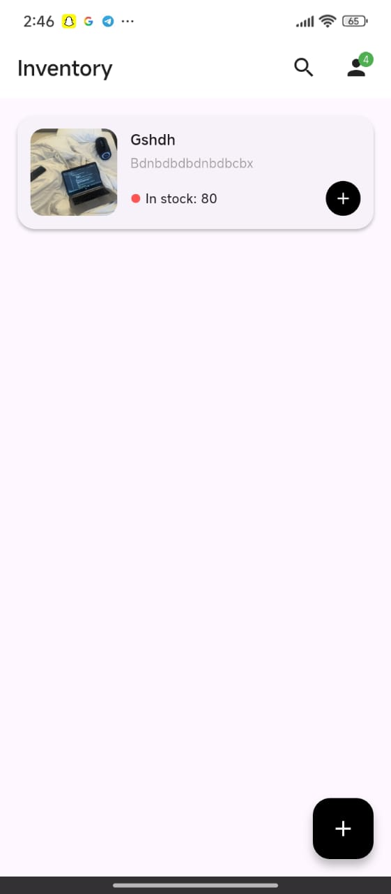
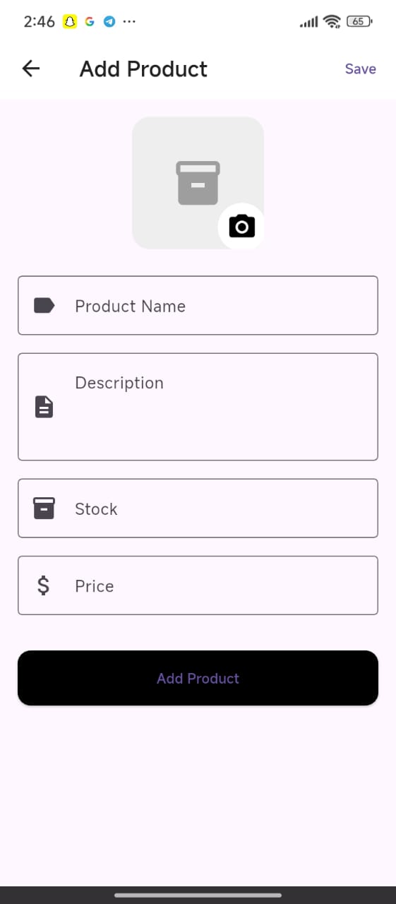
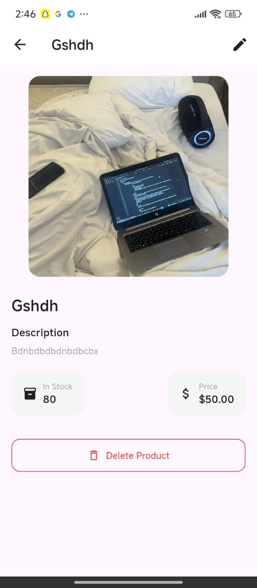

# Storekeeper App

A **local inventory management app** built with **Flutter + SQLite (sqflite)**.  
Supports **full CRUD**, **camera & gallery image upload**, **search**, and **persistent storage**.

---

## Features

- Add, View, Edit, Delete products
- Product name, stock, price, optional image
- Take photo or pick from gallery
- Search by product name
- Data persists after app restart
- Clean, modern UI

---

## Tech Stack

- **Flutter**
- **SQLite** via `sqflite`
- `image_picker` for camera/gallery
- `provider` for state management

---

## APK Download

[Download Storekeeper App APK](https://drive.google.com/file/d/YOUR_APK_LINK/view?usp=sharing)

---

## Demo Video (3 mins)

[Watch Full App Walkthrough](https://drive.google.com/file/d/YOUR_VIDEO_LINK/view?usp=sharing)

---

## GitHub Repository

[https://github.com/yourusername/storekeeper-app](https://github.com/yourusername/storekeeper-app)

---

## Screenshots

| Home | Add Product | Detail |
|------|-------------|--------|
|  |  |  |

---
